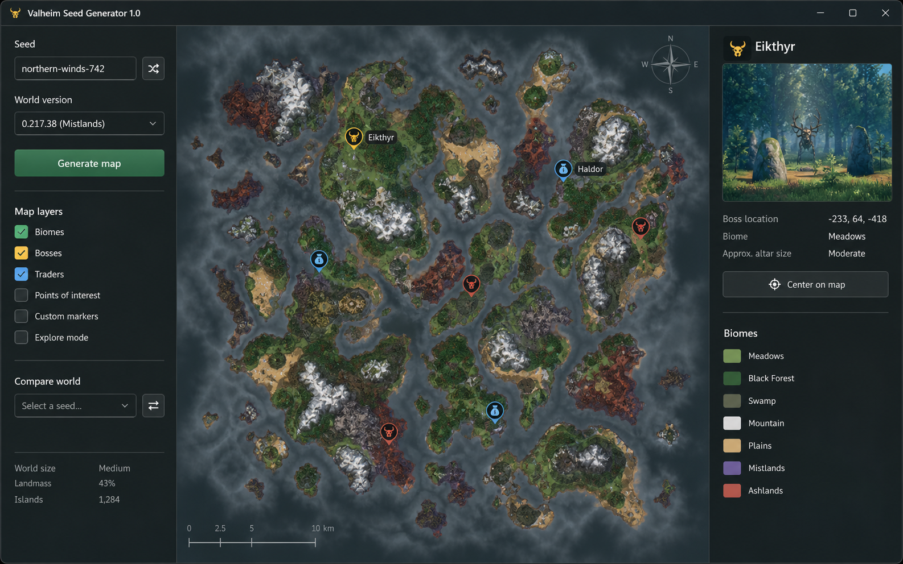

# Valheim Seed Map & Welten-Viewer

Valheim-Seeds vergleichen, Boss-Routen planen und Händler finden: Zur Kartenvorschau gehört immer die Erstellungs-Version der Welt.

<a href="./README.md">English</a> · <a href="./README_ES.md">Español</a> · <a href="./README_PT.md">Português</a> · <a href="./README_DE.md">Deutsch</a> · <a href="./README_FR.md">Français</a> · <a href="./README_CN.md">简&#8288;体&#8288;中&#8288;文</a> · <a href="./README_TW.md">繁&#8288;體&#8288;中&#8288;文</a> · <a href="./README_JP.md">日&#8288;本&#8288;語</a> · <a href="./README_KR.md">한&#8288;국&#8288;어</a>

  

## Warum es dieses Tool gibt

Eine Valheim Seed Map muss zur Erstellungs-Version der Welt passen, nicht automatisch zur aktuell installierten Spielversion. Seed, Erstellungs-Version und Kartenfilter gehören zusammen, wenn du Boss-Routen planst oder Welten vergleichst. Für nachträgliche Änderungen an bestehenden Welten können die Weltdateien erforderlich sein.

## Vor dem Start

- **Seed + Weltversion** bereithalten und prüfen, ob die Daten zum vorgesehenen Valheim-Profil bzw. zur Sitzung gehören.
- Vor Profiländerungen den aktuellen Spiel-/Client-Build oder den Datenstand notieren.
- Speicherort für **Saatgut- und Ebeneneinstellungen** festlegen, damit das vorige Ergebnis nicht überschrieben wird.
- **Versionsbewusste Weltvorschau** zuerst in einem kurzen Test verwenden und Original-Save, Profil oder Vergleich daneben behalten.

## Was das Tool macht

### 01 · Versionsbewusste Weltvorschau

Rendert Gelände mit den Generierungsregeln, die von der ausgewählten Weltversion verwendet werden.

### 02 · Boss- und Händlermarker

Ermöglicht das Ein- oder Ausblenden nützlicher Markierungsgruppen, ohne die Karte zu überladen.

### 03 · Vergleich der erforschten Welt

Platziert Daten zur erkundeten Welt neben dem generierten Startwert für einen direkten Vergleich.

## Die Oberfläche

- **01.** Saatpanel für die Saatschnur- und Weltgenerationsversion.
- **02.** Ebenensteuerung für Biome, Bosse, Händler und benutzerdefinierte Markierungen.
- **03.** Kartenleinwand mit Zoom, Koordinaten und der ausgewählten Route.
- **04.** Markierungsinspektor mit Biom, Standort und Details zu nahegelegenen Sehenswürdigkeiten.
- **05.** Weltvergleichskontrolle für einen erkundeten Save oder einen Second Seed.

## Der erste vollständige Durchlauf

1. **Valheim Seed Map & Welten-Viewer** öffnen und den erkannten Valheim-Build bzw. die Datenquelle prüfen.
2. Eingabe oder Profil wählen und **Versionsbewusste Weltvorschau** konfigurieren, ohne unbeteiligte Standardwerte zu ändern.
3. **Boss- und Händlermarker** in Vorschau oder Statusanzeige prüfen und Versions-, Filter- oder Erkennungswarnungen beheben.
4. Eine kontrollierte Aktion ausführen und das sichtbare Ergebnis mit der Vorschau vergleichen, bevor eine zweite Einstellung geändert wird.
5. Profil speichern oder Ergebnis exportieren; **Vergleich der erforschten Welt** für Vergleich und Wiederherstellung behalten.

## Auf einen Blick

| Funktion | Ergebnis |
|---|---|
| **Eingabe** | Seed + Weltversion |
| **Ergebnis** | Ebenenkarte mit Markierungen |
| **Ausgabe** | Saatgut- und Ebeneneinstellungen |

## Ergebnisse richtig lesen

Behandeln Sie die generierte Karte als einen Plan, der an einen Startwert und eine Weltversion gebunden ist. Markierungsabstand, Küstenform und Biomzugang sind zusammen nützlicher als jeder einzelne Pin. Behalten Sie beim Vergleichen von Welten die gleichen sichtbaren Ebenen und die gleiche Zoomstufe bei, sodass der Unterschied eher auf den Ausgangswert als auf die Anzeigeeinstellungen zurückzuführen ist.

## Geeignet für

- Erkunden Sie eine neue Welt
- Vergleichen Sie zwei Samen
- Finden Sie einen Weg zu einem Chef oder Händler

## Nach einem Spiel-Update

- [ ] Behalte die Erstellungs-Version der Welt bei; ein Spiel-Update allein ist kein Grund, sie zu ändern.
- [ ] Regenerieren Sie das Gelände, bevor Sie alte Markierungs- oder Routenebenen laden.
- [ ] Vergleichen Sie einen bekannten Orientierungspunkt, um eine Koordinaten- oder Generationsverschiebung zu erkennen.
- [ ] Speichern Sie das aktualisierte Ebenenprofil unter einem neuen Namen, bis die Karte überprüft ist.

## Fehlerbehebung

> **Häufiges Fehlerbild:** Boss-Marker wurden nach dem 1.0-Update verschoben.

### Markierungen erscheinen an der falschen Stelle

Bestätigen Sie die Weltversion, bevor Sie die Karte neu generieren. Die Geländeregeln können sich zwischen Builds ändern.

### Eine erforschte Welt reiht sich nicht ein

Überprüfen Sie, ob der Speicherort und der Startwert zur selben Welt gehören, und setzen Sie dann den Maßstab und die Koordinatenversätze zurück.

### Eine Markierungsebene ist leer

Löschen Sie die Kategoriefilter und erstellen Sie nur diese Ebene neu, bevor Sie die gesamte Karte neu generieren.

## Daten und Wiederherstellung

Saatkarten und Markierungsfilter sind schreibgeschützt. Exportieren Sie Profile separat, damit nach der Aktualisierung der Weltdaten eine nützliche Ebenenkonfiguration wiederhergestellt werden kann.

Automatisierung und Modifikationen nur verwenden, wenn Spielregeln und Sitzungstyp sie erlauben.

## Häufige Fragen

<strong>Kann ich einen Samen mit einer erforschten Welt vergleichen?</strong>

Ja. Laden Sie zuerst den Seed und fügen Sie dann die Daten der erkundeten Welt als Vergleichsebene hinzu. Das generierte Gelände bleibt von entdeckten Markierungen getrennt.

<strong>Was gehört in einen Kompatibilitätsbericht?</strong>

Exakten Spiel-Build, Tool- oder Datenversion, Eingabe und beobachtetes Ergebnis festhalten. Unbekannte Angaben offenlassen. Ein Bild oder Test mit einer anderen Version belegt keine aktuelle Kompatibilität.

<strong>Ist eine funktionierende Anwendung oder ein Script enthalten?</strong>

Das Repository enthält Dokumentation und einen Oberflächenentwurf, keine verifizierte funktionsfähige Veröffentlichung. Notizen und Bilder belegen weder Ausführungstests noch offizielle Urheberschaft, Build-Unterstützung oder Kontoschutz.

---

## Herunterladen

Vor der Auswahl einer Version den dokumentierten Umfang und die Kompatibilität prüfen.

---

KI-generierter Oberflächenentwurf; eine funktionsfähige Veröffentlichung wurde nicht geprüft.
